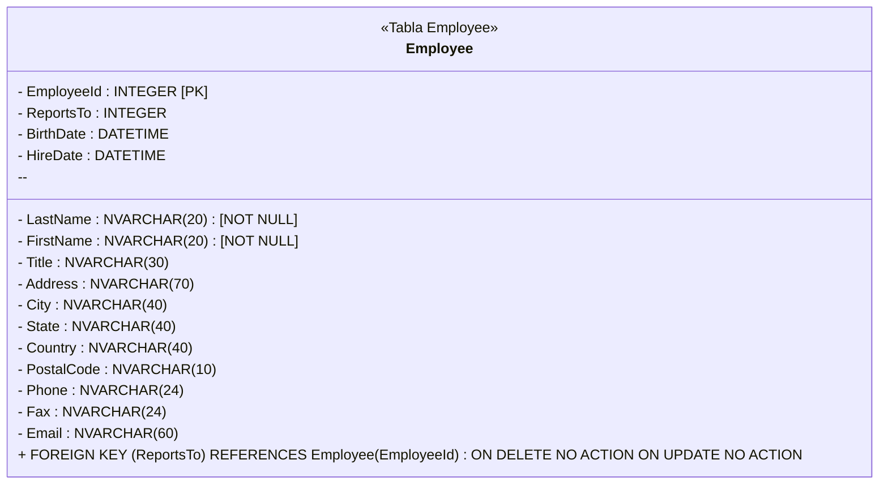

```mermaid
classDiagram
    class Employee {
        <<Tabla Employee>>

        - EmployeeId : INTEGER [PK]
        - LastName : NVARCHAR(20) [NOT NULL]
        - FirstName : NVARCHAR(20) [NOT NULL]
        - Title : NVARCHAR(30)
        - ReportsTo : INTEGER
        - BirthDate : DATETIME
        - HireDate : DATETIME
        - Address : NVARCHAR(70)
        - City : NVARCHAR(40)
        - State : NVARCHAR(40)
        - Country : NVARCHAR(40)
        - PostalCode : NVARCHAR(10)
        - Phone : NVARCHAR(24)
        - Fax : NVARCHAR(24)
        - Email : NVARCHAR(60)
        --
        <<FK>>
        + FOREIGN KEY (ReportsTo) REFERENCES Employee (EmployeeId) ON DELETE NO ACTION ON UPDATE NO ACTION
    }


```
